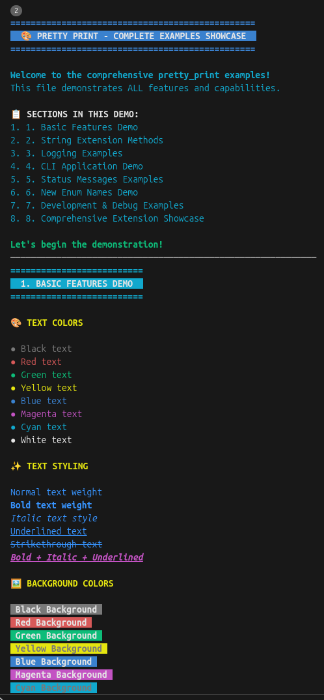
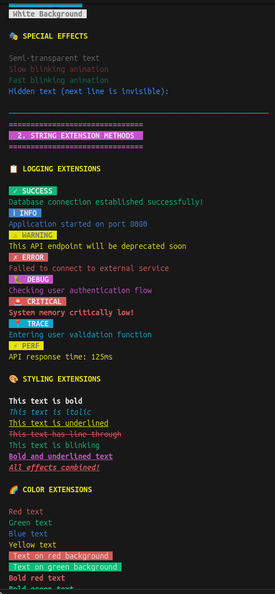
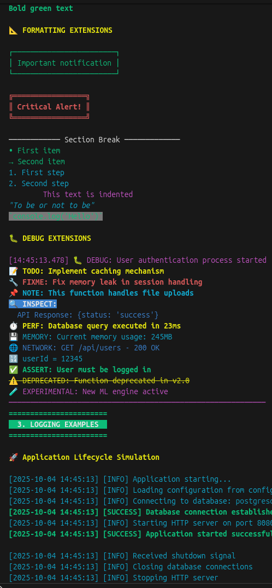

# 🎨 Pretty Print

[](https://pub.dev/packages/pretty_print)
[](https://opensource.org/licenses/MIT)

A beautiful and customizable Dart library for printing colored and styled text to the terminal using ANSI escape codes. Perfect for CLI applications, debugging, and adding visual flair to your console output!

## 🖼️ Visual Showcase

|            🎨 Colors & Text Styling             |          📋 Status Messages & Extensions           |          🎭 Advanced Formatting & Effects           |
| :---------------------------------------------: | :------------------------------------------------: | :-------------------------------------------------: |
|  |  |  |

> 🚀 **Try it yourself**: Run `dart run example/example.dart` to see all features in action!

## ✨ Features

- 🎨 **8 Beautiful Colors**: Black, Red, Green, Yellow, Blue, Magenta, Cyan, White
- 🖼️ **Background Colors**: Apply any color as background
- 🎭 **Text Styling**: Bold, Italic, Underline, Strikethrough, Blinking
- 📋 **75+ Extension Methods**: Organized into logical groups for easy discovery
- 🔧 **Grouped API**: Methods organized by category (logging, styling, colors, formatting, debug)
- 📊 **Advanced Formatting**: Boxes, headers, separators, alignment, lists
- 🐛 **Development Tools**: Debugging utilities, variable inspection, performance monitoring
- 🌈 **Special Effects**: Rainbow text, animations, and visual enhancements
- 🚀 **Cross-Platform**: Works on Windows, macOS, and Linux terminals
- 📦 **Zero Dependencies**: Lightweight and fast
- 🎯 **Type Safe**: Full Dart type safety with enums

## 🚀 Getting Started

Add this to your package's `pubspec.yaml` file:

```yaml
dependencies:
  pretty_print: ^2.1.0
```

Then run:

```bash
dart pub get
```

## 📖 Usage

Import the package:

```dart
import 'package:pretty_print/pretty_print.dart';
```

## 🎯 Grouped Extension API (v2.1.0+)

The new grouped extension system organizes methods into logical categories for better discoverability and cleaner code:

### 📝 Logging Methods

```dart
// Status logging with styled headers
"Operation completed successfully!".logging.successLog();
"Application started".logging.infoLog();
"This feature is deprecated".logging.warningLog();
"Failed to connect to database".logging.errorLog();
"Debugging user authentication".logging.debugLog();
"Critical system failure".logging.criticalLog();
"Entering function".logging.traceLog();
"Database query took 150ms".logging.performanceLog();
```

### 🎭 Text Styling Methods

```dart
// Text styling and effects
"Bold text".styling.bold();
"Italic text".styling.italic();
"Underlined text".styling.underline();
"Strikethrough text".styling.lineThrough();
"Blinking text".styling.blink();
"Bold + Underlined".styling.boldUnderline();
"All effects combined".styling.allEffects();
```

### 🌈 Color Methods

```dart
// Text colors
"Red text".colors.red();
"Green text".colors.green();
"Blue text".colors.blue();
"Yellow text".colors.yellow();

// Background colors
"Text on red background".colors.onRed();
"Text on green background".colors.onGreen();
"Text on blue background".colors.onBlue();

// Combined styling
"Bold red text".colors.boldRed();
"Bold green text".colors.boldGreen();

// Special effects
"Rainbow text!".colors.rainbow();
```

### 📋 Formatting Methods

```dart
// Layout and formatting
"Title".formatting.header();
"Content".formatting.box();
"Double border content".formatting.doubleBox();

// Lists and bullets
"First item".formatting.bullet();
"Second item".formatting.bullet();
"Step 1".formatting.numbered(1);
"Step 2".formatting.numbered(2);

// Alignment
"Left aligned text".formatting.leftAlign(30);
"Right aligned text".formatting.rightAlign(30);
"Centered text".formatting.center(30);

// Text formatting
"Important quote".formatting.quote();
"console.log('Hello')".formatting.code();
"Indented text".formatting.indent(2);

// Separators
"".formatting.separator();

// Utility methods
"Message".formatting.withPrefix(">>> ");
"Alert".formatting.withSuffix(" <<<");
```

### 🐛 Debug Methods

```dart
// Development and debugging
"Variable inspection".debug.debugPrint();
"Fix this later".debug.todo();
"This needs attention".debug.fixme();
"Important note".debug.note();
"API response data".debug.inspect();

// Performance monitoring
"Performance check".debug.benchmark();
"Memory usage".debug.memory();
"Network request status".debug.network();
"Database query result".debug.database();

// Variable inspection
"userName".debug.variable("john_doe");
"age".debug.variable(25);
"isActive".debug.variable(true);

// Development status
"User authentication passed".debug.assertion();
"Legacy method usage".debug.deprecated();
"Experimental feature active".debug.experimental();
"Security check passed".debug.security();
"Configuration loaded".debug.config();
```

## 🔧 Basic PrettyPrint.log Usage

For direct control over styling, you can still use the traditional `PrettyPrint.log` method:

```dart
// Simple colored text
PrettyPrint.log("Hello World!", textColor: PrintColor.green);

// Text with background and styling
PrettyPrint.log(
  " SUCCESS ",
  textColor: PrintColor.white,
  backColor: PrintColor.green,
  textWeight: TextWeight.bold,
);

// Combined effects
PrettyPrint.log(
  "Important Notice",
  textColor: PrintColor.red,
  textWeight: TextWeight.bold,
  textUnderline: TextUnderLine.underline,
  textBlink: TextBlink.slowBlink,
);
```

## 🎯 Why Use Grouped Extensions?

The new grouped extension system provides several benefits:

- **🔍 Better Discoverability**: IDE autocomplete shows only relevant methods for each category
- **📋 Organized Code**: Methods are logically grouped by functionality
- **🧹 Cleaner API**: Reduces namespace pollution
- **🚀 Enhanced Productivity**: Find the right method faster
- **📚 Better Documentation**: Each group is clearly documented

### Migration Example

```dart
// Old API (still works)
"Success message".successLog();
"Bold text".bold();
"Red text".red();

// New API (recommended)
"Success message".logging.successLog();
"Bold text".styling.bold();
"Red text".colors.red();
```

## 🎨 Advanced Usage Examples

### Complex Formatting

```dart
// Create professional-looking output
"System Status Report".formatting.header();
"".formatting.separator();

"CPU Usage: 45%".debug.benchmark();
"Memory: 256MB".debug.memory();
"Network: Connected".debug.network();
"Database: Online".debug.database();

"".formatting.separator();
"All systems operational".logging.successLog();
```

### CLI Application Example

```dart
// Application startup
"🚀 MyApp v1.0.0".formatting.header();

// Progress indicators
"[1/4] Initializing...".logging.infoLog();
"[2/4] Loading config...".logging.infoLog();
"[3/4] Connecting to database...".logging.infoLog();
"[4/4] Ready!".logging.successLog();

// User interactions
"Enter your name: ".colors.cyan();
// ... get user input
"Welcome, John!".logging.successLog();

// Error handling
if (error) {
  "Connection failed: ${error.message}".logging.errorLog();
  "Please check your network settings".logging.warningLog();
}
```

### Development & Debugging

```dart
// Variable inspection
"userName".debug.variable(currentUser.name);
"isAuthenticated".debug.variable(user.isAuth);
"requestCount".debug.variable(stats.requests);

// Performance monitoring
"Database query completed".debug.benchmark();
"Memory usage: ${getMemoryUsage()}MB".debug.memory();
"API response time: ${responseTime}ms".debug.network();

// Development notes
"TODO: Implement caching".debug.todo();
"FIXME: Handle edge case".debug.fixme();
"NOTE: This is a temporary solution".debug.note();
```

## 🚀 Common Use Cases

### Status Messages

```dart
// Using grouped extensions (recommended)
"Operation completed successfully".logging.successLog();
"Loading user preferences".logging.infoLog();
"API endpoint deprecated".logging.warningLog();
"Connection failed".logging.errorLog();
"System debug info".logging.debugLog();
```

### Professional CLI Output

```dart
"🚀 Application Startup".formatting.header();
"Loading configuration...".logging.infoLog();
"Database connected".logging.successLog();

"📊 System Status".formatting.box();
"CPU: 45%".debug.benchmark();
"Memory: 256MB".debug.memory();
"Connections: 1,247".debug.network();
```

### Development & Debugging

```dart
"Add user authentication".debug.todo();
"Fix memory leak in cache".debug.fixme();
"Performance looks good".debug.note();

"userId".debug.variable("user_123");
"isAuthenticated".debug.variable(true);
"responseTime".debug.variable("89ms");
```

### Professional Output

```dart
"Application Report".formatting.header();
"".formatting.separator();

"System Metrics".formatting.leftAlign(20);
"Status: Online".formatting.rightAlign(15, PrintColor.green);

"Last Updated".formatting.leftAlign(20);
DateTime.now().toString().formatting.rightAlign(25, PrintColor.cyan);
```

## 📚 API Reference

### 🔧 Extension Groups

#### `.logging` - Status Logging Methods

- `successLog()` - Green success message with ✓ icon
- `infoLog()` - Blue info message with ℹ icon
- `warningLog()` - Yellow warning message with ⚠ icon
- `errorLog()` - Red error message with ✗ icon
- `debugLog()` - Magenta debug message with 🐛 icon
- `criticalLog()` - Red blinking critical message with 🚨 icon
- `traceLog()` - Cyan trace message with 📍 icon
- `performanceLog()` - Yellow performance message with ⚡ icon

#### `.styling` - Text Styling Methods

- `bold([color])` - Bold text with optional color
- `italic([color])` - Italic text with optional color
- `underline([color])` - Underlined text with optional color
- `lineThrough([color])` - Strikethrough text with optional color
- `blink([color])` - Blinking text with optional color
- `fastBlink([color])` - Fast blinking text with optional color
- `dim([color])` - Dimmed text with optional color
- `hide()` - Hidden text
- `boldUnderline([color])` - Combined bold and underline
- `italicUnderline([color])` - Combined italic and underline
- `allEffects([color])` - All text effects combined

#### `.colors` - Color Methods

**Text Colors:**

- `black()`, `red()`, `green()`, `yellow()`, `blue()`, `magenta()`, `cyan()`, `white()`

**Background Colors:**

- `onBlack()`, `onRed()`, `onGreen()`, `onYellow()`, `onBlue()`, `onMagenta()`, `onCyan()`, `onWhite()`

**Combined Colors:**

- `boldRed()`, `boldGreen()`, `boldBlue()`, `boldYellow()`, `boldMagenta()`, `boldCyan()`, `boldWhite()`

**Special Effects:**

- `rainbow()` - Rainbow colored text

#### `.formatting` - Layout & Formatting Methods

**Containers:**

- `header([color])` - Header with decorative borders
- `box([borderColor])` - Single-line box around text
- `doubleBox([borderColor])` - Double-line box around text

**Lists:**

- `bullet([color])` - Bullet point (•)
- `numbered(number, [color])` - Numbered list item

**Alignment:**

- `leftAlign(width, [color])` - Left-aligned text
- `rightAlign(width, [color])` - Right-aligned text
- `center(width, [color])` - Centered text

**Text Formatting:**

- `quote([color])` - Quoted text with italic styling
- `code([color])` - Code formatting with monospace background
- `indent(level)` - Indented text

**Utilities:**

- `separator([color])` - Horizontal separator line
- `withPrefix(prefix, [color])` - Add prefix to text
- `withSuffix(suffix, [color])` - Add suffix to text

#### `.debug` - Development & Debugging Methods

**Basic Debug:**

- `debugPrint()` - Debug message with timestamp
- `todo()` - TODO note with 📝 icon
- `fixme()` - FIXME note with 🔧 icon
- `note()` - General note with 📌 icon
- `inspect()` - Inspect data with 🔍 icon

**Performance:**

- `benchmark()` - Performance message with ⏱️ icon
- `memory()` - Memory usage with 💾 icon
- `network()` - Network status with 🌐 icon
- `database()` - Database status with 🗄️ icon

**Development:**

- `variable(value)` - Variable inspection with 🔢 icon
- `assertion()` - Assertion message with ✅ icon
- `deprecated()` - Deprecation warning with ⚠️ icon
- `experimental()` - Experimental feature with 🧪 icon
- `security()` - Security message with 🔒 icon
- `config()` - Configuration message with ⚙️ icon

### 🎨 Available Colors

- `PrintColor.black`, `PrintColor.red`, `PrintColor.green`, `PrintColor.yellow`
- `PrintColor.blue`, `PrintColor.magenta`, `PrintColor.cyan`, `PrintColor.white`

### 🎭 Text Styling Options

- `TextWeight.bold` / `TextWeight.normal`
- `TextItalic.italic` / `TextItalic.none`
- `TextUnderLine.underline` / `TextUnderLine.none`
- `TextThroughLine.lineThrough` / `TextThroughLine.none`

### ✨ Special Effects

- `TextBlink.slowBlink` - Slow blinking animation
- `TextBlink.fastBlink` - Fast blinking animation
- `TextBlink.semiOpacity` - Semi-transparent text
- `TextBlink.hide` - Hidden text

### 🔗 Extension Categories (75+ Methods)

#### 📋 Logging (8 methods)

`successLog()`, `infoLog()`, `warningLog()`, `errorLog()`, `debugLog()`, `criticalLog()`, `traceLog()`, `performanceLog()`

#### 🎨 Styling (12 methods)

`bold()`, `italic()`, `underline()`, `lineThrough()`, `blink()`, `fastBlink()`, `dim()`, `hide()`, `boldUnderline()`, `italicUnderline()`, `allEffects()`

#### 🌈 Colors (25+ methods)

`red()`, `green()`, `blue()`, `onRed()`, `onGreen()`, `boldRed()`, `boldGreen()`, `rainbow()`, etc.

#### 📐 Formatting (16 methods)

`header()`, `box()`, `doubleBox()`, `separator()`, `leftAlign()`, `center()`, `bullet()`, `numbered()`, `indent()`, `quote()`, `code()`, etc.

#### 🐛 Debug (16 methods)

`todo()`, `fixme()`, `note()`, `debugPrint()`, `inspect()`, `variable()`, `benchmark()`, `memory()`, `network()`, `security()`, etc.

```dart
// Debug info
PrettyPrint.pprint("[DEBUG]",
  textColor: PrintColor.blue,
  textWeight: TextWeight.bold
);

// Info message
PrettyPrint.pprint("[INFO]",
  textColor: PrintColor.cyan
);

// Hidden sensitive data
PrettyPrint.pprint("Secret: password123",
  textBlink: TextBlink.hide
);
```

## 🎨 Available Options

### Colors (`PrintColor`)

- `PrintColor.black`
- `PrintColor.red`
- `PrintColor.green`
- `PrintColor.yellow`
- `PrintColor.blue`
- `PrintColor.magenta`
- `PrintColor.cyan`
- `PrintColor.white`
- `PrintColor.none` (default)

### Text Weight (`TextWeight`)

- `TextWeight.normal`
- `TextWeight.bold`
- `TextWeight.none` (default)

### Text Styling

- `TextItalic.italic` / `TextItalic.none`
- `TextUnderLine.underline` / `TextUnderLine.none`
- `TextThroughLine.lineThrough` (strikethrough) / `TextThroughLine.none`

### Blinking and Opacity Effects (`TextBlink`)

- `TextBlink.semiOpacity` - Semi-transparent text
- `TextBlink.hide` - Hidden text
- `TextBlink.slowBlink` - Slow blinking
- `TextBlink.fastBlink` - Fast blinking
- `TextBlink.none` (default)

## 🎯 Complete Example

```dart
import 'package:pretty_print/pretty_print.dart';

void main() {
  // Header
  PrettyPrint.pprint("=== PRETTY PRINT DEMO ===",
    textColor: PrintColor.white,
    backColor: PrintColor.blue,
    textWeight: TextWeight.bold
  );

  // Colors demonstration
  print("\n🎨 Colors:");
  PrettyPrint.pprint("Red", textColor: PrintColor.red);
  PrettyPrint.pprint("Green", textColor: PrintColor.green);
  PrettyPrint.pprint("Blue", textColor: PrintColor.blue);
  PrettyPrint.pprint("Yellow", textColor: PrintColor.yellow);

  // Styling demonstration
  print("\n✨ Styles:");
  PrettyPrint.pprint("Bold text", textWeight: TextWeight.bold);
  PrettyPrint.pprint("Italic text", textItalic: TextItalic.italic);
  PrettyPrint.pprint("Underlined text", textUnderline: TextUnderLine.underline);

  // Effects demonstration
  print("\n🎭 Effects:");
  PrettyPrint.log("Blinking text", textBlink: TextBlink.slowBlink);
  PrettyPrint.log("Semi-transparent", textBlink: TextBlink.semiOpacity);

  // Status messages
  print("\n📋 Status Messages:");
  PrettyPrint.pprint(" SUCCESS ",
    textColor: PrintColor.white,
    backColor: PrintColor.green,
    textWeight: TextWeight.bold
  );

  PrettyPrint.pprint(" WARNING ",
    textColor: PrintColor.black,
    backColor: PrintColor.yellow,
    textWeight: TextWeight.bold
  );

  PrettyPrint.pprint(" ERROR ",
    textColor: PrintColor.white,
    backColor: PrintColor.red,
    textWeight: TextWeight.bold
  );
}
```

## 🛠️ Terminal Compatibility

This package works with most modern terminals that support ANSI escape codes:

- ✅ **Windows**: Windows Terminal, PowerShell, Command Prompt (Windows 10+)
- ✅ **macOS**: Terminal.app, iTerm2, and other terminal emulators
- ✅ **Linux**: GNOME Terminal, Konsole, xterm, and most terminal emulators
- ✅ **IDEs**: VS Code integrated terminal, IntelliJ terminal, and others

## 🤝 Contributing

Contributions are welcome! If you have suggestions, bug reports, or want to contribute code:

1. Fork the repository
2. Create your feature branch (`git checkout -b feature/amazing-feature`)
3. Commit your changes (`git commit -m 'Add some amazing feature'`)
4. Push to the branch (`git push origin feature/amazing-feature`)
5. Open a Pull Request

## 📝 License

This project is licensed under the MIT License - see the [LICENSE](LICENSE) file for details.

## 👨‍💻 Author

**Mohamed Maher** - [GitHub](https://github.com/mohamedmaher-dev)

- 📧 Email: mohamedmaher.personal@gmail.com
- 💼 LinkedIn: [Mohamed Maher](https://linkedin.com/in/mohamedmaher-dev)
- 🌍 Portfolio: [Portfolio Website](https://mohamedmaher-dev.github.io/portfolio)

## ⭐ Support

If you like this package, please give it a ⭐ on [GitHub](https://github.com/mohamedmaher-dev/pretty_print) and a 👍 on [pub.dev](https://pub.dev/packages/pretty_print)!

## 📚 More Packages

Check out my other packages:

- [`id_generator`](https://pub.dev/packages/id_generator) - Generate secure, customizable random IDs
- [`easy_in_app_notify`](https://pub.dev/packages/easy_in_app_notify) - Beautiful in-app notifications for Flutter
- [`mena`](https://pub.dev/packages/mena) - Middle East and North Africa country data utilities

---

Made with ❤️ by Mohamed Maher
